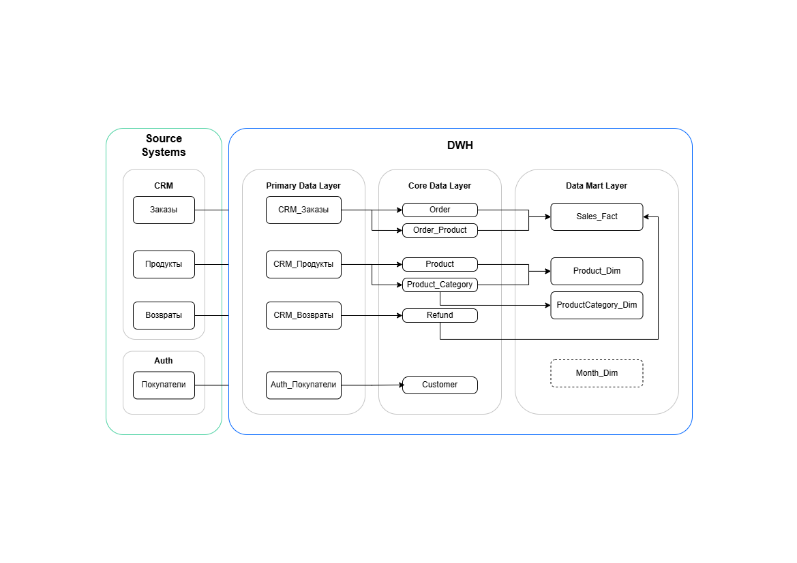
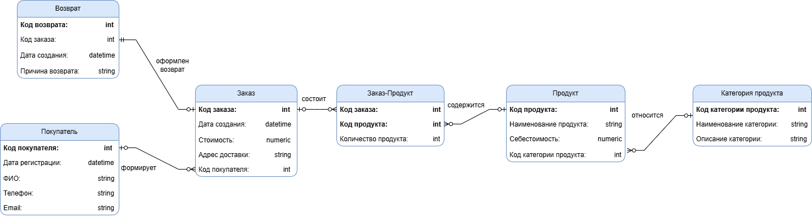
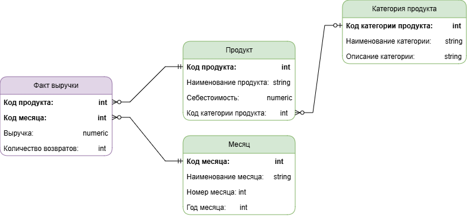

# **Проектирование хранилища данных для интернет-магазина**

## Цель проекта
Разработать многослойную архитектуру хранилища данных, модели Core и Data Mart, а также технические спецификации для ETL-процессов.

## Задачи проекта
Интернет-магазину требуется отчёт по выручке и количеству возвратов в разрезе продуктов и категорий помесячно.  
**Источники данных:**
- **Auth** – таблица покупателей;
- **CRM** – таблицы заказов, продуктов, возвратов.

Необходимо:
1. Построить логические модели Core (3NF) и Data Mart («снежинка»).
2. Разработать физические модели и технические спецификации для слоёв Primary, Core и Data Mart.
3. Спроектировать ETL-процесс переноса данных между слоями.

## **Стек технологий**
| Категория | Инструменты | 
|------|--------|------|
| Моделирование| draw.io (ER-диаграммы) |
| База данных | PostgreSQL |
| Документация | Google Sheets, Markdown |
| Концепции | DWH, ETL, 3NF, Dimensional Modeling (Snowflake) |

## Архитектура решения
Хранилище построено по классической трёхуровневой схеме:

- **Source Systems** – исходные системы (CRM, Auth).
- **Primary Data Layer** – слой сырых данных, повторяющий структуру источников.
- **Core Data Layer** – нормализованная модель (3NF), очищенные и структурированные данные.
- **Data Mart Layer** – витрина данных для аналитики (схема «снежинка»).

## Модели данных
### Core Data Layer (3NF)
Модель состоит из следующих сущностей:
- `Customer` – покупатели;
- `Order` – заказы;
- `Order_Product` – связь заказов с продуктами (many-to-many);
- `Product` – продукты;
- `Product_Category` – категории продуктов;
- `Refund` – возвраты.

### Data Mart Layer (схема «снежинка»)
Витрина для отчёта по выручке и возвратам:
- `Sales_Fact` – факты продаж (выручка, количество возвратов);
- `Product_Dim` – измерение продуктов;
- `ProductCategory_Dim` – измерение категорий;
- `Month_Dim` – измерение месяцев.

## Технические спецификации
Для каждого слоя подготовлена спецификация, содержащая описание таблиц, атрибутов, типов данных, ключей и логики формирования.

- [Primary Data Layer](specifications/primary_data_layer.xlsx) – описание систем-источников и их таблиц.
- [Core Data Layer](specifications/core_data_layer.xlsx) – физическая модель Core-слоя.
- [Data Mart Layer](specifications/data_mart_layer.xlsx) – физическая модель витрины.

## ETL-процесс
Потоки данных:
1. **Source → Primary** – ежедневная загрузка из CRM и Auth в слой сырых данных.
2. **Primary → Core** – очистка, нормализация, выделение справочников (категории, связь заказов и продуктов).
3. **Core → Data Mart** – агрегация выручки и подсчёт количества возвратов по месяцам и продуктам.

## Результаты
В ходе проекта:
- Спроектирована нормализованная модель Core (3NF), учитывающая все бизнес-сущности.
- Разработана витрина данных для анализа выручки и возвратов.
- Составлены полные технические спецификации, готовые к передаче разработчикам ETL.
- Визуализированы потоки данных между слоями DWH.
  
---

**Автор:** [Францева Юлия](https://career.habr.com/jf_yukka)
