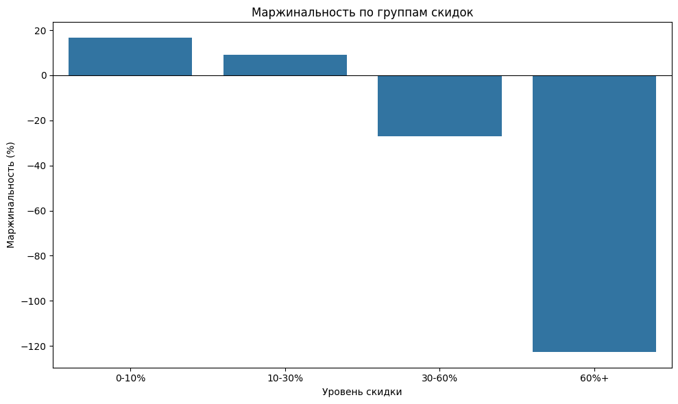
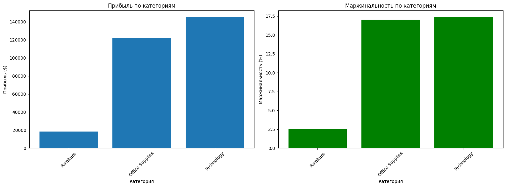
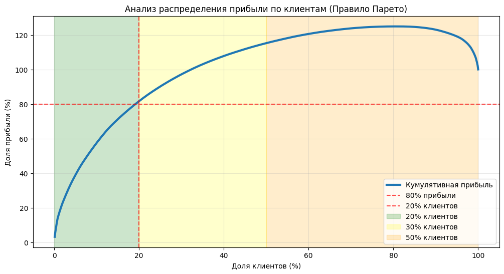

# **Анализ прибыльности и выявление проблемных зон в сети супермаркетов "SuperStore"**

Аналитическое исследование данных розничной сети "SuperStore" за 2014–2017 годы с целью выявления причин периодических убытков и разработки рекомендаций для повышения прибыльности.

## **Задачи проекта**

1. Выявить убыточные категории товаров.
2. Проанализировать влияние скидок на прибыль.
3. Определить наиболее прибыльных клиентов и вклад клиентских сегментов в общую прибыль.
4. Предложить рекомендации по увеличению прибыльности.

## **Стек технологий**
-   **Язык:** Python 3
-   **Библиотеки:** pandas, numpy, matplotlib, seaborn

## **Обзор данных**

**Источник данных:** Kaggle (Superstore Sales Dataset)
**Период данных:** 2014-2017 годы
**Структура данных:**
- 9994 строки, 21 столбец
- Ключевые поля: 
	- _Sales_ - выручка (общая сумма продажи).
	- _Profit_ - прибыль (разница между выручкой и себестоимостью).
	- _Discount_ - предоставленная скидка.
	- _Category_ - категория товара.
	- _Sub-Category_ - подкатегория товара.
	- _Customer ID_ - уникальный идентификатор для идентификации каждого клиента.
- Отсутствующих значений не обнаружено

## **Результаты**

### **Ключевые выводы**
- Скидки выше 30% — главный драйвер убытков.
- Категория Furniture, особенно Tables и Bookcases, нерентабельна.
- Половина клиентской базы работает в убыток, а 20% ключевых клиентов генерируют >80% прибыли.

### **Общая картина бизнеса**
- Общий объём продаж: $2 297 200.86
- Общая прибыль: $286 397.02
- Средняя маржинальность: 12.5%
- Средний чек: $458.61
- Средняя прибыль на заказ: $57.18

### **Проверка гипотез**

1. **Гипотеза: высокие скидки (>30%) приводят к отрицательной прибыли**
    - **Результат:** подтверждена
    - Маржинальность при скидках 30–60%: –26.93%
    - Маржинальность при скидках 60%+: –122.63%
> **Рекомендация:** Пересмотреть политику скидок. Ограничить скидки уровнем 20-25%. Внедрить систему персональных предложений вместо массовых больших скидок.

2. **Категория "Furniture" имеет самую низкую рентабельность**
	- **Результат:** подтверждена
	- Маржинальность: 2.49%
	- Доля в прибыли: 6.44%
	- Наибольшие убытки приносят подкатегории "Tables" (-8.5% маржинальности) и "Bookcases" (-3.2%).
> **Рекомендация:** Провести детальный анализ цепочки поставок и себестоимости мебели. Рассмотреть возможность оптимизации логистики или изменения ассортимента.

3. **20% клиентов приносят 80% прибыли (правило Парето)**
	- **Результат:** подтверждена
	- 20% клиентов приносят 81.4% прибыли.
	- 50% клиентов работают в убыток (-15% прибыли)
> **Рекомендации:**
> - **Для топ-20% клиентов:** внедрить систему VIP-обслуживания с персональными менеджерами.
> - **Для убыточных 50% клиентов:** оптимизировать работу с сегментом — перевести на автоматизированное обслуживание, ограничить скидки, минимизировать издержки.
> - **Для средних 30% клиентов:** разработать программу перехода в топ-сегмент.

---

**Автор:** [Францева Юлия](https://career.habr.com/jf_yukka)
**Ноутбук с проектом:** [Открыть в Google Colab](https://colab.research.google.com/drive/1tWdR47OAkBccI2jnqaZV9fA4agvwFTya?usp=sharing)
